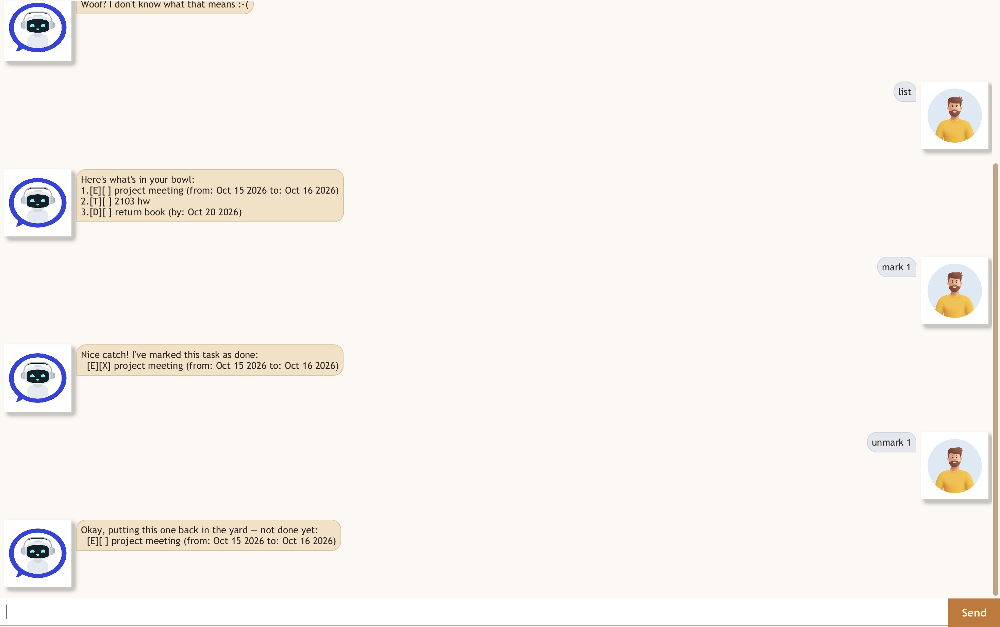

# Rex User Guide



Rex is a task-fetching sidekick: a desktop chatbot that keeps your todos,
deadlines and events in one list and answers in plain commands rather than
menus. You type a line, Rex does the thing and shows you the result. Your
tasks are saved automatically, so they are still there the next time you
open him.

## Quick start

1. Make sure you have **Java 25 or later** installed.
2. Download the latest `rex.jar` from the
   [releases page](https://github.com/matthewbiju/ip/releases).
3. Put it in a folder of its own. Rex makes a `data` folder inside whatever
   directory he is started from, so running him from his own folder keeps
   the save file with him.
4. Run it, either by double-clicking the JAR or with:

   ```
   java -jar rex.jar
   ```

5. Type a command into the box at the bottom and press **Enter** or click
   **Send**. Try `todo read book` to begin, and `list` to see what you have.

## Reading a task

Every task is shown with two boxes in front of it:

```
2.[D][X] return book (by: Oct 15 2019)
│  │  └── done: X if finished, blank if not
│  └───── kind: T todo, D deadline, E event, W within-period
└──────── the number you use for mark, unmark and delete
```

The number is the task's place in the full list. Rex keeps that number even
when he shows you only some of your tasks, so a number you see in a search
result is still the right one to mark or delete.

## Writing dates

Dates are written as `yyyy-mm-dd`, optionally followed by a 24-hour time:

| You type | Rex shows |
| --- | --- |
| `2019-10-15` | Oct 15 2019 |
| `2019-10-15 1800` | Oct 15 2019, 6:00PM |

The time needs all four digits, so `0900` rather than `900`.

## Features

### Adding a todo: `todo`

Adds a task with no date attached.

Format: `todo DESCRIPTION`

A description can hold almost anything except the `|` character, which Rex
uses to separate fields in his save file. This goes for every kind of task:

```
> todo buy milk | eggs
Ruff! A description can't contain '|' — I use it to keep your tasks apart in the save file.
```

Example: `todo read book`

```
Got it! I've fetched this task for you:
  [T][ ] read book
You now have 1 tasks in your bowl!
```

### Adding a deadline: `deadline`

Adds a task that has to be finished by a particular date.

Format: `deadline DESCRIPTION /by DATE`

Example: `deadline return book /by 2019-10-15`

```
Got it! I've fetched this task for you:
  [D][ ] return book (by: Oct 15 2019)
You now have 2 tasks in your bowl!
```

### Adding an event: `event`

Adds something that runs from one date to another. An event is happening
*throughout* its period.

Format: `event DESCRIPTION /from START /to END`

Example: `event project meeting /from 2019-10-15 1400 /to 2019-10-15 1600`

```
Got it! I've fetched this task for you:
  [E][ ] project meeting (from: Oct 15 2019, 2:00PM to: Oct 15 2019, 4:00PM)
You now have 3 tasks in your bowl!
```

### Adding a task to be done within a period: `within`

Adds something you must do at some point *inside* a window, without knowing
yet which day you will do it. This is the difference from an event: an event
is going on the whole time, while a within-period task is one thing you can
do on any of those days.

Format: `within DESCRIPTION /from START /to END`

Example: `within collect certificate /from 2026-01-15 /to 2026-01-25`

```
Got it! I've fetched this task for you:
  [W][ ] collect certificate (within: Jan 15 2026 to Jan 25 2026)
You now have 4 tasks in your bowl!
```

### Listing everything: `list`

Shows every task you have, numbered.

Format: `list`

```
Here's what's in your bowl:
1.[T][ ] read book
2.[D][ ] return book (by: Oct 15 2019)
3.[E][ ] project meeting (from: Oct 15 2019, 2:00PM to: Oct 15 2019, 4:00PM)
4.[W][ ] collect certificate (within: Jan 15 2026 to Jan 25 2026)
```

### Marking a task as done: `mark`

Format: `mark NUMBER`

Example: `mark 1`

```
Nice catch! I've marked this task as done:
  [T][X] read book
```

### Marking a task as not done: `unmark`

Undoes a `mark`.

Format: `unmark NUMBER`

Example: `unmark 1`

```
Okay, putting this one back in the yard — not done yet:
  [T][ ] read book
```

### Deleting a task: `delete`

Removes a task for good. The tasks after it move up a number, so check with
`list` before deleting several in a row.

Format: `delete NUMBER`

Example: `delete 1`

```
Gotcha! I've removed this task from your bowl:
  [T][ ] read book
You now have 3 tasks in your bowl!
```

### Seeing one day: `on`

Shows every task falling on a given day. A deadline counts on the day it is
due; an event and a within-period task count on every day they cover,
including the first and last.

Format: `on DATE` — a plain date, with no time of day.

Example: `on 2019-10-15`

```
Here's what's on Oct 15 2019:
2.[D][ ] return book (by: Oct 15 2019)
3.[E][ ] project meeting (from: Oct 15 2019, 2:00PM to: Oct 15 2019, 4:00PM)
```

If nothing falls on that day:

```
Nothing on Oct 15 2019 — your bowl's empty that day!
```

### Searching: `find`

Shows the tasks whose description contains what you typed. The search
ignores capitals and matches any part of a word, so `book` finds both
`read book` and `visit bookshop`. What you type is taken as one phrase, so
`find return book` looks for that phrase rather than for either word.

Format: `find KEYWORD`

Example: `find book`

```
Here's what matches "book":
1.[T][ ] read book
2.[D][ ] return book (by: Oct 15 2019)
```

If nothing matches:

```
No sign of "bicycle" in your bowl!
```

### Leaving: `bye`

Says goodbye and closes Rex.

Format: `bye`

```
Bye! *wags tail* Hope to fetch for you again soon!
```

## Saving your tasks

Rex saves after every command that changes something, to `data/rex.txt` in
the directory he was started from. There is no save command and nothing to
remember to do.

The file is plain text, so you can edit it by hand if you like. If a line
becomes unreadable Rex skips just that line, tells you how many he skipped,
and keeps the rest — but those skipped lines are lost the next time he
saves, so keep a copy before editing.

## When something goes wrong

Rex refuses a command he cannot make sense of, explains why, and carries on:
nothing you have already entered is lost. The most common ones:

| What you typed | What Rex says |
| --- | --- |
| `todo` | Ruff! The description of a todo cannot be empty. |
| `deadline return book` | Ruff! A deadline needs a '/by' date, e.g. deadline return book /by 2019-10-15. |
| `deadline return book /by Sunday` | Woof! I don't understand the date "Sunday". Write it as yyyy-mm-dd… |
| `mark 99` | Woof! There's no task numbered 99 in your bowl. |
| `blah` | Woof? I don't know what that means :-( |

## Command summary

| Command | Format | Example |
| --- | --- | --- |
| Add a todo | `todo DESCRIPTION` | `todo read book` |
| Add a deadline | `deadline DESCRIPTION /by DATE` | `deadline return book /by 2019-10-15` |
| Add an event | `event DESCRIPTION /from START /to END` | `event meeting /from 2019-10-15 1400 /to 2019-10-15 1600` |
| Add a within-period task | `within DESCRIPTION /from START /to END` | `within collect certificate /from 2026-01-15 /to 2026-01-25` |
| List everything | `list` | `list` |
| Mark as done | `mark NUMBER` | `mark 1` |
| Mark as not done | `unmark NUMBER` | `unmark 1` |
| Delete | `delete NUMBER` | `delete 1` |
| See one day | `on DATE` | `on 2019-10-15` |
| Search | `find KEYWORD` | `find book` |
| Exit | `bye` | `bye` |
